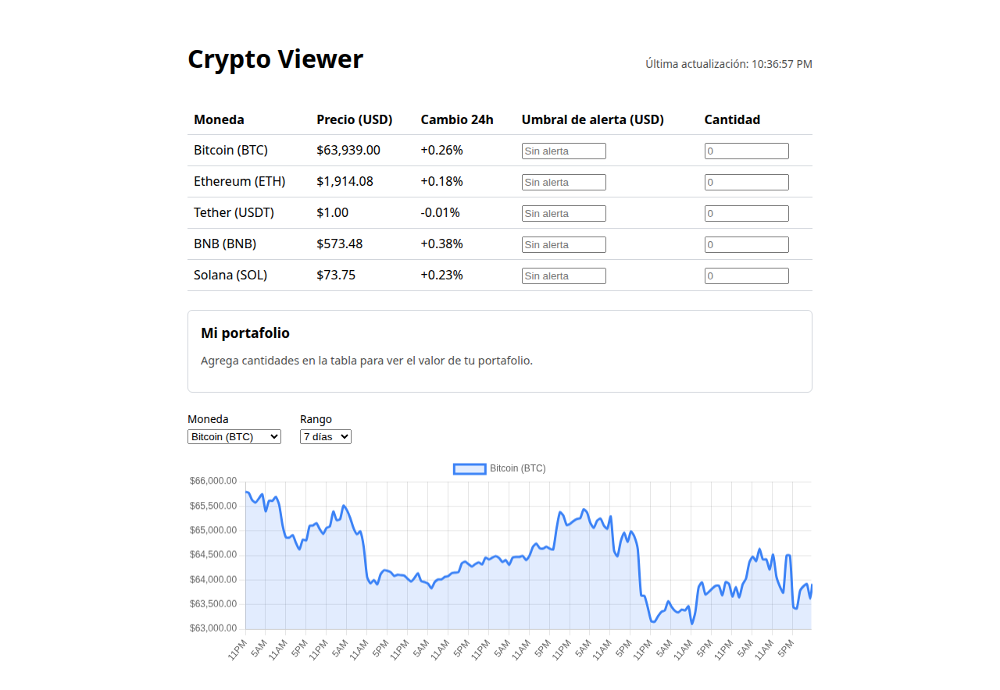
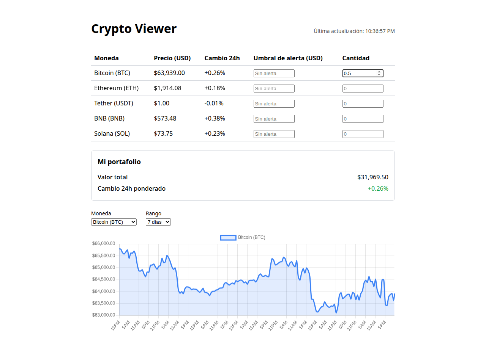

# Crypto Viewer


A cryptocurrency dashboard that tracks and analyzes real-time data for BTC, ETH, USDT, BNB, and SOL, with
historical charts, price alerts, and a personal portfolio value tracker.

## Demo

Live demo: _add your Render URL here after deploying (see [Deployment](#deployment))_

| Live prices, chart, and alerts         | Portfolio tracker                                 |
| -------------------------------------- | ------------------------------------------------- |
|  |  |

## Features

- Live prices and 24h change for 5 coins (BTC, ETH, USDT, BNB, SOL), polled every 30s
- Historical price chart (1d / 7d / 30d / 90d / 1y) powered by Chart.js
- Per-coin price alert thresholds with in-page banners and browser notifications
- **Portfolio value tracker**: enter how much of each coin you hold and see your total value and
  value-weighted 24h change update live, persisted in the browser (no account needed)
- A CLI mode that prints current prices as a table in the terminal

## Tech stack

- Node.js + Express (REST API, static file serving, in-memory TTL caching with stale-data fallback)
- Vanilla JavaScript on the client (no framework) + Chart.js for the historical chart
- [CoinGecko public API](https://www.coingecko.com/en/api) as the data source
- `node:test` + `c8` for unit/integration tests and coverage, GitHub Actions for CI
- ESLint (flat config) + Prettier for linting and formatting

## Architecture

- `src/coingecko.js` is the single source of truth for coin metadata (ids, labels, symbols) and all CoinGecko
  API calls — both the server and the CLI import from it.
- `server.js` is an Express app exposing `/api/coins`, `/api/prices`, and `/api/history/:coinId`, with
  short-lived in-memory caches per endpoint. If CoinGecko is unreachable, `/api/prices` falls back to the last
  known cached data and flags the response as `stale`.
- `public/` is a static client that polls `/api/prices`, renders the price table/chart, and manages alerts and
  portfolio holdings client-side via `localStorage`.
- `cli.js` reuses `src/coingecko.js` to print the same price data as a table in the terminal.

## Getting started

```
npm install
npm start              # runs the web server on http://localhost:3000
npm run cli            # prints current prices in the terminal
npm test               # runs the test suite
npm run test:coverage  # runs the test suite with a coverage report
npm run lint           # checks code with ESLint
npm run format         # checks formatting with Prettier (use format:write to fix)
```

## Deployment

This repo includes a [`render.yaml`](render.yaml) Blueprint for deploying to [Render](https://render.com) as a
free Node web service (`npm ci` to build, `npm start` to run — Render provides `PORT` automatically, no other
env vars are needed):

1. Push this repo to GitHub and sign in to Render with that account.
2. **New +** → **Blueprint**, select this repo (Render will read `render.yaml` automatically). Alternatively,
   create a Web Service manually with build command `npm ci` and start command `npm start`.
3. Deploy and wait for the build to finish, then copy the live `https://<service>.onrender.com` URL into the
   Demo section above.

Note: Render's free tier spins services down after inactivity, so the first request after idling can take
~30s to respond while it cold-starts.

## License

MIT
